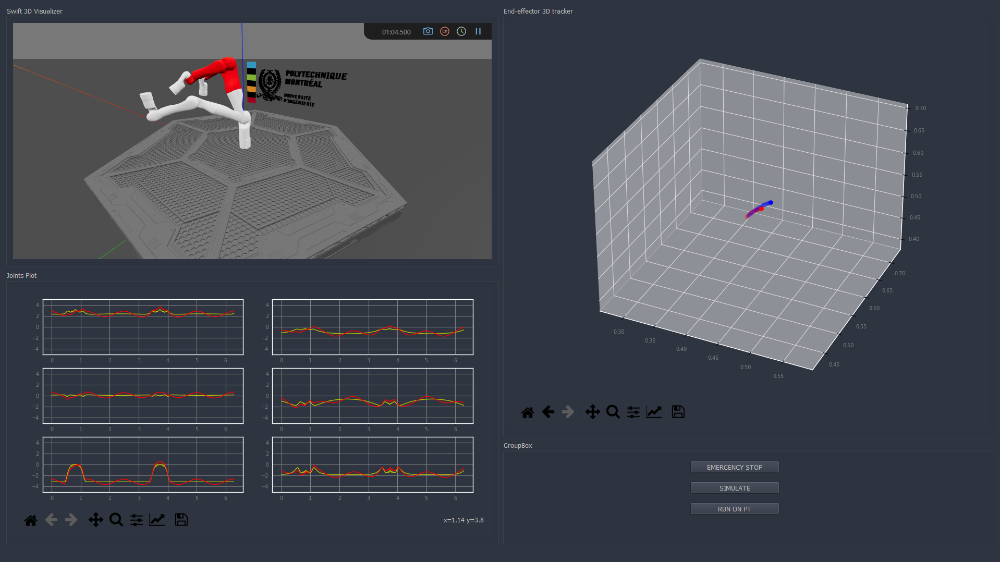

# Kinova Gen 3 Robotic Arm Digital Twin

In this project, which is part of the Digital Twin Engineering course at Polytechnique Montreal, we aim to develop a digital twin for the Kinova robotic arm.

This digital twin shows the deviation in the trajectory and joints by comparing the expected one and the real one. It also has a built-in simulator ([Robotics Toolbox](https://github.com/petercorke/robotics-toolbox-python)) that can calculate the expected trajectory and simulate the robot before commanding the real robot (physical twin) to move.

The digital twin has the ability to automatically stop the physical twin (DT->PT Loop) in case of singularity or high deviation. The GUI represents the physical twin in a 3D model (digital shadow) and snapshots robot when it goes into singular points with making the involved arms red.

| sample screenshot 1 | sample screenshot 2|
| --- | ---|
|  | | 

| GUI screenshot 1 | GUI screenshot 2|
| --- | ---|
|  |  |
