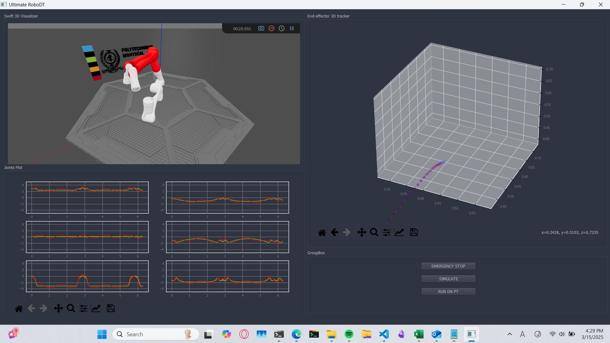

# Kinova Gen 3 Robotic Arm Digital Twin

In this project, which is part of the Digital Twin Engineering course at Polytechnique Montreal, we aim to develop a digital twin for the Kinova robotic arm.

This digital twin shows the deviation in the trajectory and joints by comparing the expected one and the real one. It also has a built-in simulator ([Robotics Toolbox](https://github.com/petercorke/robotics-toolbox-python)) that can calculate the expected trajectory and simulate the robot before commanding the real robot (physical twin) to move.

The digital twin has the ability to automatically stop the physical twin (DT->PT Loop) in case of singularity or high deviation. The GUI represents the physical twin in a 3D model (digital shadow) and snapshots robot when it goes into singular points with making the involved arms red.

| sample screenshot 1 | sample screenshot 2|
| --- | ---|
|  | | 

| GUI screenshot 1 | GUI screenshot 2|
| --- | ---|
|  |  |


# Real world robot control
To control the robot we will use a docker image with ROS2 Humble already install and set-up.
## Getting Started
Download the docker image:
```python
docker pull dmhum/project_rosie:vnc-humble-amd64-HOST-Sim-moveit-source`
```
Next you need to run th docker image with VNC display specific settings, as well as with the mounted volume to share the code between the host and the docker container:
```python
docker run --name Container_Humble_Rosie --volume="<PathToShareFolderOnYourComputer>:/home/ubuntu/Documents/Rosie_Project/docker/share" -p 6080:80 --security-opt seccomp=unconfined --shm-size=512m --cap-add=NET_ADMIN --cap-add=SYS_ADMIN --device=/dev/net/tun --ipc host --net host dmhum/project_rosie:vnc-humble-amd64-HOST-Sim-moveit-source
```
You need to wait several minutes for the docker to load properly. 
Then you can access the VNC display by opening the browser and typing ``` http://127.0.0.1:6080/ ```
and clicking on connect. If ever you are asked for a password, it is ``` ubuntu ```.

Once inside the container, run the following commands to start the simulation:
```python
ros2 launch kinova_gen3_7dof_robotiq_2f_85_moveit_config sim.launch.py \
  use_sim_time:=true
```
Then execute the code to control the robot.
```python
ros2 run hello_moveit hello_moveit
```
To edit this example go to the following path in the container:
```python
~/moveit2_ws/src/hello_moveit/src/hello_moveit.cpp
```